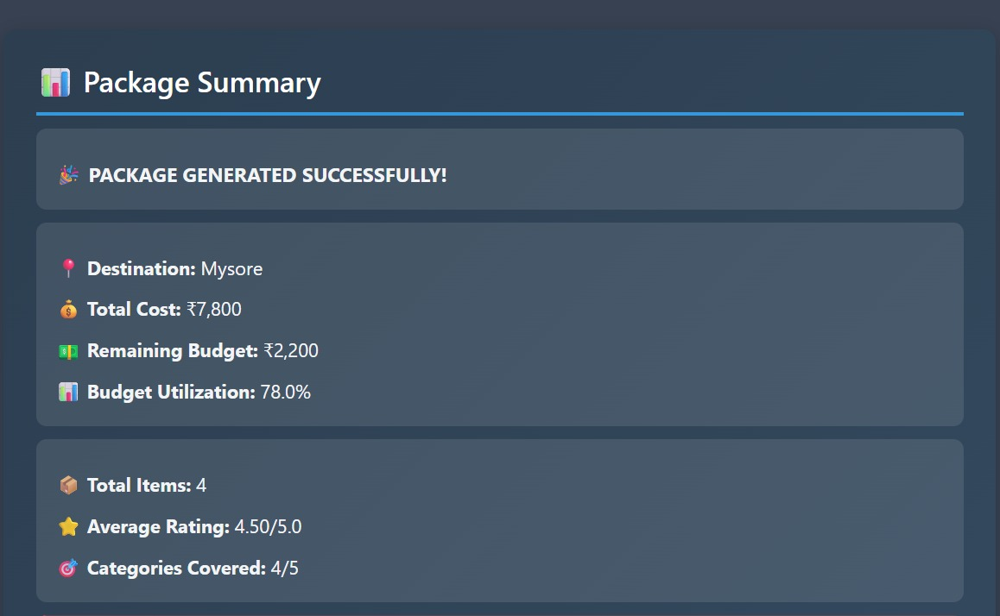
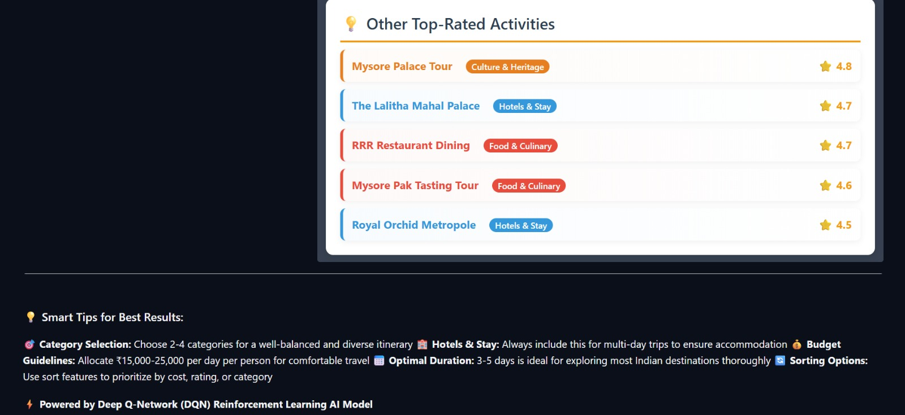

# smart-tourism-recommendation-dqn
Smart AI-powered tourism recommendation system using Deep Reinforcement Learning (DQN)

## 📌 Overview
This project presents a **Smart AI-powered Tourism Recommendation System** developed using  
**Deep Reinforcement Learning (Deep Q-Network – DQN)**.

The system intelligently recommends suitable tourism destinations and travel packages by
learning optimal decision-making policies from user preferences and interactions.
Unlike traditional static recommendation systems, this model continuously improves
its recommendations through reinforcement learning.

To enhance usability and demonstrate real-world applicability, the project also includes
an **interactive web-based user interface built with Gradio**, enabling users to receive
real-time tourism recommendations in an intuitive and user-friendly manner.


The system recommends suitable tourism destinations or packages by learning optimal
policies from user preferences and feedback. Unlike traditional recommendation systems,
this approach continuously improves recommendations through reinforcement learning.

---

## 🧠 Problem Statement
Conventional tourism recommendation systems are mostly static and do not adapt well to
changing user preferences.  
This project addresses the problem by modeling the recommendation task as a
**reinforcement learning environment**, where an agent learns to recommend tourism
packages that maximize user satisfaction.

---

## 🛠️ Tech Stack
- **Python**
- **Deep Reinforcement Learning (DQN)**
- **TensorFlow / Keras**
- **Gradio (UI Interface)**
- NumPy, Pandas
- Matplotlib
- Jupyter Notebook
- Google Colab

---

## 📂 Project Structure

smart-tourism-recommendation-dqn
├── README.md
├── requirements.txt
├── notebooks/
│   ├── README.md
│   ├── training_dqn.ipynb
│   └── inference_recommendation.ipynb
├── data/
│   ├── README.md
│   └── india_tourism_dataset.csv
├── models/
│   ├── README.md
│   └── dqn_model.h5
├── screenshots/
│   ├── README.md
│   ├── tourism_img-1.jpeg
│   ├── tourism_img-2.jpeg
│   ├── tourism_img-3.jpeg
│   ├── tourism_img-4.jpeg
│   └── tourism_img-5.jpeg


---

## ⚙️ Workflow
1. Data preprocessing from tourism dataset  
2. Environment and state design  
3. Reward function definition  
4. DQN model architecture creation  
5. Model training using reinforcement learning  
6. Model saving  
7. Inference and tourism recommendation generation  

---

## 📊 Results & Outputs
Below are sample outputs and visual results from the trained DQN model:





---

## ▶️ How to Run the Project

### 1️⃣ Install dependencies

```bash
pip install -r requirements.txt
```

### 2️⃣ Train the model

Open and run the training notebook:

```
notebooks/training_dqn.ipynb
```

### 3️⃣ Run inference

After training (or using the saved model), run:

```
notebooks/inference_recommendation.ipynb
```

### Learning Outcomes

1.Implemented Deep Q-Network (DQN) from scratch
2.Designed a custom reinforcement learning environment
3.Built an AI-based tourism recommendation system
4.Gained hands-on experience with training and inference workflows

### Author

Jivan Prasath S
B.Tech – Robotics and Artificial Intelligence
SASTRA Deemed University


